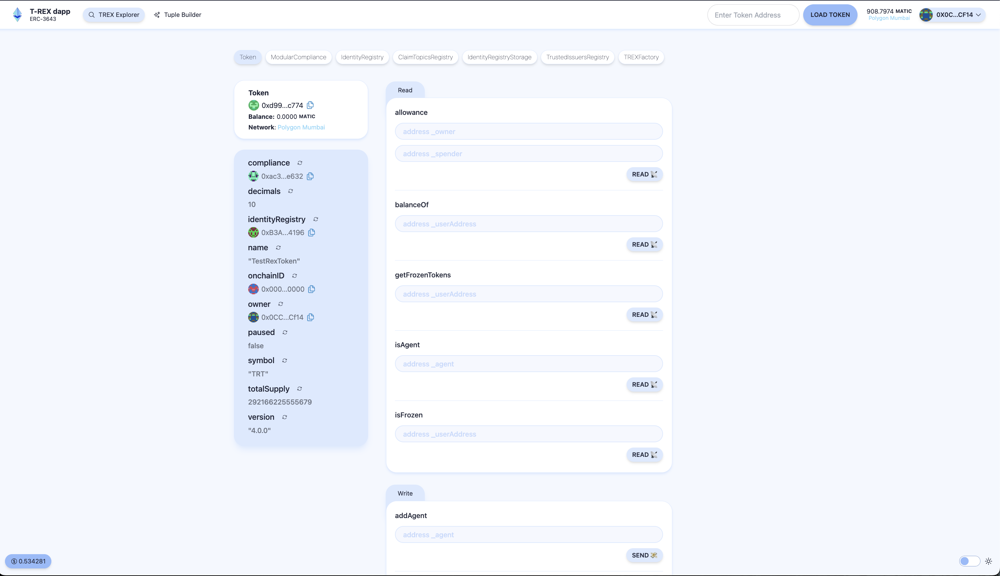

# 🏗 ERC-3643-DApp

<h4 align="center">
  <a href="https://www.erc3643.org/">Official Website</a>
</h4>

🧪 The ERC-3643-DApp is an open-source project initiated by the ERC-3643 association. It aims to promote the use of the ERC-3643 standard for tokenized assets by providing a robust and scalable decentralized application.

⚙️ Built upon the foundation of Scaffold-ETH 2, using NextJS, RainbowKit, Hardhat, Wagmi, and Typescript.

- ✅ **Token Loading**: Easily load any ERC-3643 compliant token by pasting its address.
- 🔐 **Integration with Wallet Providers**: Connect to different wallet providers and interact with the Ethereum network.



## Requirements

Before you begin, you need to install the following tools:

- [Node (v18 LTS)](https://nodejs.org/en/download/)
- [Yarn (v1 or v2+)](https://yarnpkg.com/getting-started/install)
- [Git](https://git-scm.com/downloads)
- [ts-node](https://www.npmjs.com/package/ts-node) (For running the server)

## Quickstart

To get started with ERC-3643-DApp, follow the steps below:

1. Clone this repo & install dependencies

```
git clone https://github.com/ERC-3643/ERC-3643-DApp.git
cd ERC-3643-DApp
yarn install
```

2. In one terminal, run the server:

```
ts-node server.ts
```

3. In a second terminal, start your NextJS app:

```
yarn start
```

Visit your app on: `http://localhost:3000`. To load a specific ERC-3643 compliant token, paste its address into the form in the navbar and click "Load Token".

## Documentation

For more information about the ERC-3643 standard and the association's initiatives, visit the [official website](https://www.erc3643.org/).

## Contributing to ERC-3643-DApp

We welcome contributions to the ERC-3643-DApp!

Please see [CONTRIBUTING.MD](https://github.com/ERC-3643/ERC-3643-DApp/blob/main/CONTRIBUTING.md) for more information and guidelines for contributing to ERC-3643-DApp.

---
